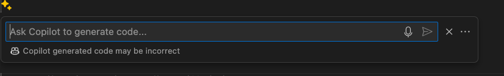
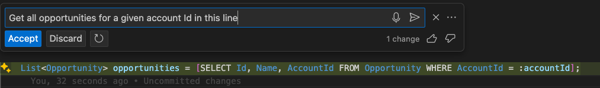
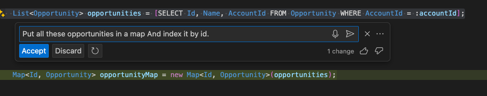
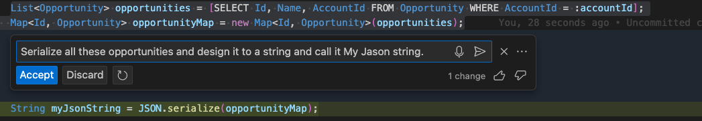

I have tried out GitHub Copilot and here are my initial impressions.

To my surprise, it worked well with Epix, which is proprietary to Salesforce. I generated a test class for a batch of Apex code and it generated a sensible test script. I also played around with generating snippets of code at specific lengths. It was able to generate code to get all opportunities for a given account ID and put them in a map indexed by ID. I was impressed with the generated snippets.

Overall, I think GitHub Copilot is a useful tool that can save developers a lot of time when learning a new language or feature. Instead of searching for syntax on websites like Stack Overflow, you can simply ask Copilot to generate the code for you.

One thing I'm excited about is how Copilot can save time when working with new features or writing code for Visualforce pages and Lightning components.

 #trigger it by clicking on the golden shiny star icon. 

I believe that understanding concepts is more important than struggling with syntax, especially in the Salesforce ecosystem with its various technologies like Visualforce, Aura components, and Lightning Web Components. Copilot has helped me write code without syntax errors.

I will continue using Copilot as I create more classes and will share further insights.

As an engineer, I recommend adopting this disruptive technology. It may change expectations for deliverables from engineers, but it can make us more efficient and enable quicker turnaround times.

I foresee a future where the boundaries between programming languages start to blur, as Copilot can generate code in any language. This will prioritize analytical skills in solving business problems rather than focusing on specific programming languages. However, it is still important for engineers to verify the code generated by Copilot.

While there may be concerns about job roles being eliminated, using Copilot can save time and allow engineers to focus on different areas.
